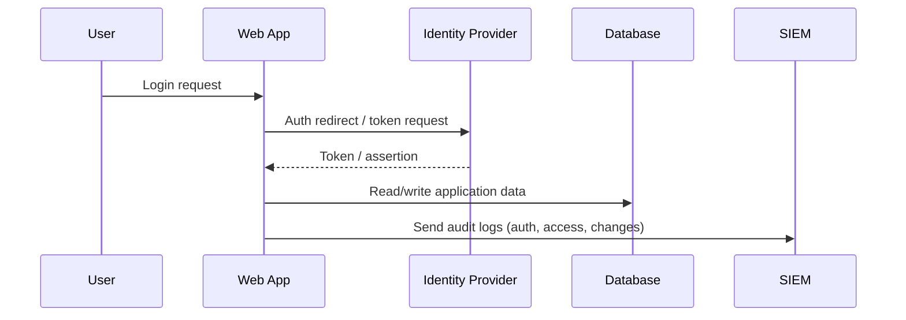

# Data Flow Diagram (Mermaid)

```mermaid
sequenceDiagram
  participant U as User
  participant W as Web App
  participant I as Identity Provider
  participant D as Database
  participant L as SIEM

  U->>W: Login request
  W->>I: Auth redirect / token request
  I-->>W: Token / assertion
  W->>D: Read/write application data
  W->>L: Send audit logs (auth, access, changes)
```
