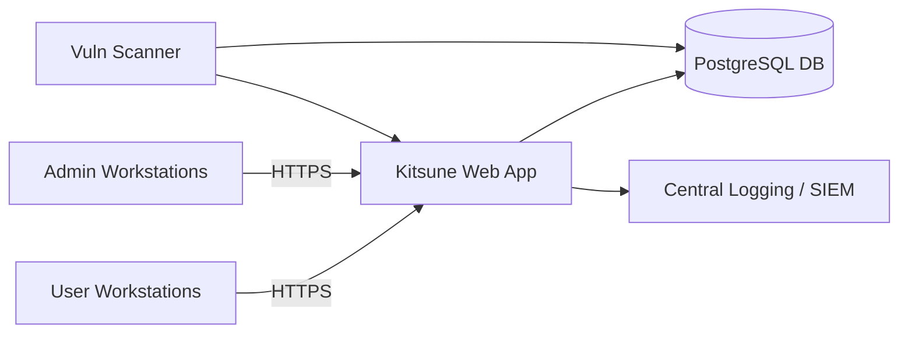

# Boundary Diagram (Mermaid)

> Replace with your final diagram. Mermaid renders directly on GitHub.

```mermaid
flowchart LR
  User[User Workstations] -->|HTTPS| Web[Kitsune Web App]
  Admin[Admin Workstations] -->|HTTPS| Web
  Web --> DB[(PostgreSQL DB)]
  Web --> Log[Central Logging / SIEM]
  Scanner[Vuln Scanner] --> Web
  Scanner --> DB
```
